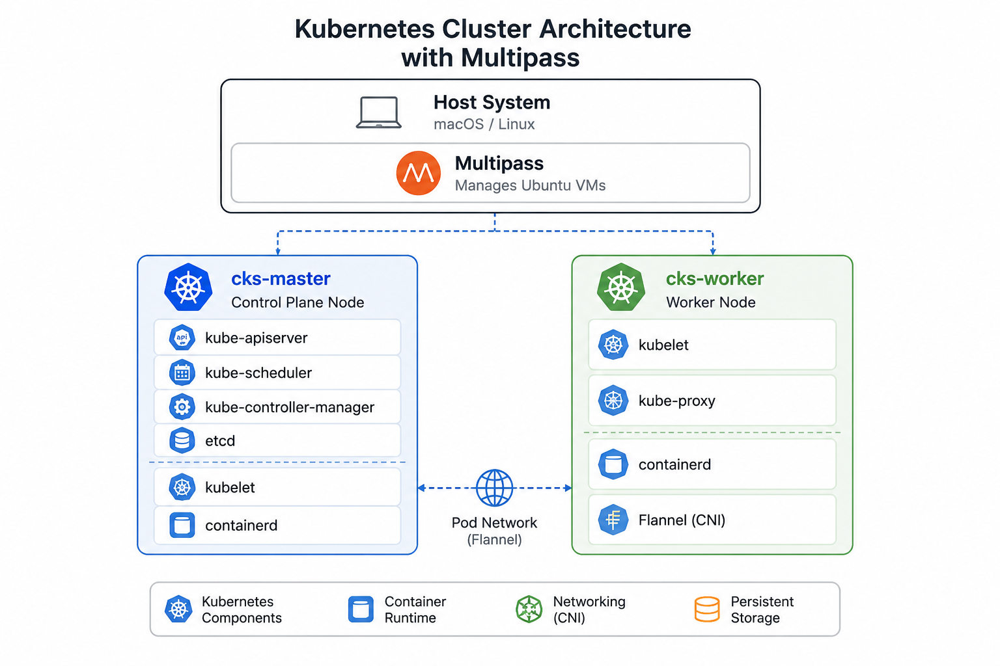

# Simple Kubernetes Cluster with Multipass and kubeadm

A lightweight Kubernetes lab environment built with **Multipass**, **kubeadm**, and **containerd**.

This project provides a simple and reproducible way to deploy a Kubernetes cluster using Ubuntu virtual machines managed by Multipass. It is ideal for Kubernetes learning, CKA/CKS exam preparation, testing workloads, and experimenting with cluster administration in a local environment.

The setup is optimized for both **ARM64** (Apple Silicon M1/M2/M3 and ARM-based Linux hosts) and **x86_64** systems.

---

# Table of Contents

- [Architecture](#architecture)
- [Prerequisites](#prerequisites)
- [Quick Start](#quick-start)
- [Usage](#usage)
- [Cleanup](#cleanup)

---

# Architecture



# Prerequisites

## Host Requirements

### macOS

- Apple Silicon (M1/M2/M3) or Intel
- Multipass installed

### Linux

- Ubuntu 22.04 or newer
- Multipass installed

## Verify Multipass Installation

```bash
multipass version
```

Expected output:

```text
multipass   x.x.x
multipassd  x.x.x
```

---

# Quick Start

## 1. Copy the repo

```bash
git clone https://github.com/FlyingChris1/simple-kubeadm-kubernetes-with-multipass.git
cd simple-kubeadm-kubernetes-with-multipass
```

## 1. Create the Virtual Machines


```bash
./launch-2vm.sh
```

---

## 2. Copy the Installation Scripts

Copy the master installation script:

```bash
multipass transfer master-install-all.sh \
  cks-master:/home/ubuntu/master-install-all.sh
```

Copy the worker installation script:

```bash
multipass transfer worker-install-all.sh \
  cks-worker:/home/ubuntu/worker-install-all.sh
```

---

## 3. Install the Control Plane

Connect to the master node:

```bash
multipass shell cks-master
```

Run the installation:

```bash
sudo ./install-all.sh
```

The script will:

- Configure kernel modules
- Configure sysctl settings
- Disable swap
- Install containerd
- Install Kubernetes components
- Initialize the cluster using kubeadm
- Install Flannel networking
- Generate a worker join command

At the end of the installation you will receive a command similar to:

```bash
kubeadm join <MASTER-IP>:6443 \
  --token <TOKEN> \
  --discovery-token-ca-cert-hash sha256:<HASH>
```

Save this command for the next step.

---

## 4. Join the Worker Node

Connect to the worker:

```bash
multipass shell cks-worker
```

Run:
> Now paste the saved command in the placeholder

```bash
sudo ./worker-install-all.sh \
'kubeadm join <MASTER-IP>:6443 --token <TOKEN> --discovery-token-ca-cert-hash sha256:<HASH>'
```

Wait until the worker successfully joins the cluster.

---

## 5. Verify the Cluster

Return to the master node and verify:

```bash
kubectl get nodes
```

Expected output:

```text
NAME         STATUS   ROLES           VERSION
cks-master   Ready    control-plane   v1.34.x
cks-worker   Ready    <none>          v1.34.x
```

Check system pods:

```bash
kubectl get pods -A
```

All pods should eventually reach the `Running` state.

---

## 6. More workers (Optional)

Create another VM:

```bash
multipass launch 26.04 --name <vm name> -c 2 -m 2G -d 6G
```

Transfer the worker-install-all.sh to your new worker VM:

```bash
multipass transfer worker-install-all.sh \
  <VM name>:/home/ubuntu/worker-install-all.sh
```

SSH into your VM and run the script with the master token:

```bash
sudo ./worker-install-all.sh \
'kubeadm join <MASTER-IP>:6443 --token <TOKEN> --discovery-token-ca-cert-hash sha256:<HASH>'
```


---

# Usage

## Show Cluster Nodes

```bash
kubectl get nodes -o wide
```

---

## Show Cluster Pods

```bash
kubectl get pods -A
```

---

## Deploy a Test Application

Create a simple NGINX deployment:

```bash
kubectl create deployment nginx \
  --image=nginx
```

Verify:

```bash
kubectl get deployments
kubectl get pods
```

---

## Scale a Deployment

Scale NGINX to three replicas:

```bash
kubectl scale deployment nginx \
  --replicas=3
```

Verify:

```bash
kubectl get pods -o wide
```

---

## Delete a Deployment

```bash
kubectl delete deployment nginx
```

---

# Cleanup

Delete all virtual machines:

```bash
multipass delete cks-master cks-worker
multipass purge
```

Verify cleanup:

```bash
multipass list
```

---
